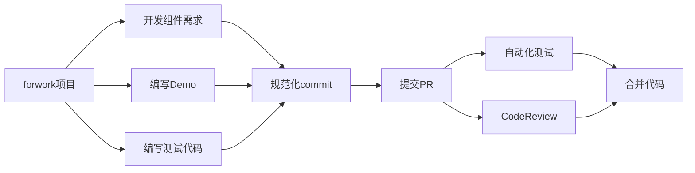

# 贡献指南

## 开发规范



* forwork项目到自己空间系啊， 从 test 分支 拉取 （feature/xx 新功能， fix/xxx 修复代码）然后提交pull request，运行完测试流程和 code reivew 后合并；
* 一个分支只完成一个功能或修复（feature）， fix bugs 允许一个分支修复多个bug、但是 commit里需要区分；
* 进行 feature 和 fix 开始时必须写测试代码，放在对应组件目录下的 test/features  或 test/fixes 目录下，例如

```
|-- Button
|---- __test__
|------- features                   -- 新功能测试代码
|---------- click.spec.js             -- 测试点击功能
|---------- render.spec.js            -- 测试渲染功能
|------- fixes                      -- 修复 bug
|---------- router-link.spec.js       -- 修复 路由环境下点击bug
```

## 代码提交规范

commit 按照以下规范提交，修复历史版本bug 需要在 提交PR 后备注， 如： 同步到v3.5.x

```
  * feat: 增加新功能
  * fix: 修复 bug
  * docs: 只改动了文档相关的内容
  * style: 不影响代码含义的改动，例如去掉空格、改变缩进、增删分号
  * refactor: 代码重构时使用，既不是新增功能也不是代码的bud修复
  * perf: 提高性能的修改
  * test: 添加或修改测试代码
  * build: 构建工具或者外部依赖包的修改，比如更新依赖包的版本
  * ci: 持续集成的配置文件或者脚本的修改
  * chore: 杂项，其他不需要修改源代码或不需要修改测试代码的修改
  * revert: 撤销某次提交

例如:
feat(Button): 增加路由点击。。
fix(Button): 修复xxxx
```
