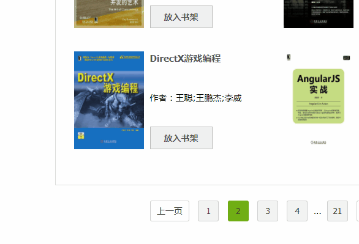

# 弹出层系列

在前端页面开发中，经常会遇到工具提示、下拉菜单、选择框、日期选择等这类组件，它们都有一个共性，就是弹出层功能。

简单的悬浮提示我们可以用如下 CSS 很快实现它。

``` css
.popper { display: none; }
.root:hover .popper { display: block; }
```

但遇到需要`click`事件触发，或者不一定是父子元素的情况，就有些捉襟见肘了。

有时同学会封装一个单纯的`v-click-outside`指令，来临时解决关闭弹出层的效果，但这需要补充一些额外的代码来完成。不同的组件相同的逻辑，势必包含了一些冗余的工作。

而且由于组件在页面中位置的不确定性，简单的弹出层不能处理边缘情况。例如，对于`overflow: visible`的容器，可能会造成页面的抖动；而对于`overflow`其他值的容器，又需要滚动才能完全显示。



这时就急需一个基础组件，能够“填”以上各种情况的“坑”。

## 功能设计

### 弹出层 [Popper](/proto-ui/m-popper)

目前市面上有的一个流行的开源库 [Popper.js](https://popper.js.org/)，它较好地解决了边缘情况、位置计算等问题。

Proto UI 中的 [Popper 组件](/proto-ui/m-popper)就是用 Vue 对它作了一层封装。

#### 插槽

我们可以发现，前面提到的那些弹出层相关组件，都需要具备一个**触发节点（参考节点）**和**弹出层节点**。

> 这里使用“触发节点”一词比“触发元素”更合适，因为有时节点是一个组件。

`<m-popper>`就是这样设计的，它的基本用法如下：

``` html
<u-button>
    click
    <m-popper>
        <u-block>popper</u-block>
    </m-popper>
</u-button>
```

默认的 slot 用于表示触发节点（参考节点），popper slot 用于表示弹出层节点。由于 Vue 的限制，每个 slot 中只能有一个根节点。

#### 触发方式

Proto UI 中设计了5种触发方式：`'click'`, `'hover'`, `'right-click'`, `'double-click'`, `'manual'`。

#### 开关属性

所有的弹出层统一使用`open`属性来表示弹出状态，支持用`.sync`方式进行双向绑定，不支持`v-model`（因为它不是一个表单特性）。

#### 弹出位置

与 Popper.js 相同，有12种弹出位置：`'top'`, `'bottom'`, `'left'`, `'right'`, `'top-start'`, `'top-end'`, `'bottom-start'`, `'bottom-end'`, `'left-start`',` 'left-end'`, `'right-start'`, `'right-end'`。

### 弹出框 [Popup](/proto-ui/u-popup)

`<m-popper>`它本身没有模板和样式，是解决弹出层问题的抽象组件。`<u-popup>`在它的基础上具体化，带有三角箭头，并可以在不同插槽填充一些内容。

``` html
<u-linear-layout>
    <u-button>
        内容
        <u-popup>使用 content 属性添加内容</u-popup>
    </u-button>
    <u-button>
        标题
        <u-popup title="标题">使用 title 属性添加标题</u-popup>
    </u-button>
    <u-button>
        使用 slot
        <u-popup>
            <span slot="title">标题 <u-badge :value="3"></u-badge></span>
            <span>使用 <u-link>slot</u-link> 可以添加一些复杂功能</span>
        </u-popup>
    </u-button>
</u-linear-layout>
```

#### 自定义

使用 root slot 可以很方便的重新自定义内容，与`<u-menu>`组件结合就是 Dropdown 下拉菜单，与`<u-calendar>`组件结合就是 DatePicker，与`<u-pallette>`组件（调色板）结合就是 ColorPicker，与`<u-tree-view>`组件结合就是树型选择。

``` html
<u-linear-layout>
    <u-button>
        Dropdown
        <u-popup>
            <u-menu slot="root" value="3" :router="false">
                <u-menu-item value="1">指南</u-menu-item>
                <u-menu-item value="2">概念</u-menu-item>
                <u-menu-item value="3">组件</u-menu-item>
            </u-menu>
        </u-popup>
    </u-button>
    <u-button>
        TreeView
        <u-popup>
            <u-tree-view slot="root">
                <u-tree-view-node text="节点1">
                    <u-tree-view-node text="节点1.1"></u-tree-view-node>
                    <u-tree-view-node text="节点1.2">
                        <u-tree-view-node text="节点1.2.1"></u-tree-view-node>
                        <u-tree-view-node text="节点1.2.2"></u-tree-view-node>
                    </u-tree-view-node>
                    <u-tree-view-node text="节点1.3"></u-tree-view-node>
                    <u-tree-view-node text="节点1.4"></u-tree-view-node>
                </u-tree-view-node>
                <u-tree-view-node text="节点2"></u-tree-view-node>
                <u-tree-view-node text="节点3">
                    <u-tree-view-node text="节点3.1"></u-tree-view-node>
                    <u-tree-view-node text="节点3.2"></u-tree-view-node>
                </u-tree-view-node>
            </u-tree-view>
        </u-popup>
    </u-button>
</u-linear-layout>
```

唯一可能需要补充的逻辑就是选择后自动关闭弹出层，这个可以在封装后的组件中处理。

``` vue
<template>
    <u-button>
        TreeView
        <u-popup ref="popup">
            <u-tree-view slot="root" @select="onSelect">
                <u-tree-view-node text="节点1">
                    <u-tree-view-node text="节点1.1"></u-tree-view-node>
                    <u-tree-view-node text="节点1.2">
                        <u-tree-view-node text="节点1.2.1"></u-tree-view-node>
                        <u-tree-view-node text="节点1.2.2"></u-tree-view-node>
                    </u-tree-view-node>
                    <u-tree-view-node text="节点1.3"></u-tree-view-node>
                    <u-tree-view-node text="节点1.4"></u-tree-view-node>
                </u-tree-view-node>
                <u-tree-view-node text="节点2"></u-tree-view-node>
                <u-tree-view-node text="节点3">
                    <u-tree-view-node text="节点3.1"></u-tree-view-node>
                    <u-tree-view-node text="节点3.2"></u-tree-view-node>
                </u-tree-view-node>
            </u-tree-view>
        </u-popup>
    </u-button>
</template>

<script>
export default {
    name: 'u-tree-select',
    methods: {
        onSelect() {
            this.$refs.popup.toggle(false);
        },
    },
};
</script>
```

> 具体业务中可以扩展箭头样式，如果不需要可直接使用`<m-popper>`。

## 相关组件

### 工具提示 [Tooltip](/proto-ui/u-tooltip)

工具提示与弹出框 Popup 类似，只是样式上的不同，并且将默认的触发方式设置为`hover`。依然由默认 slot 来设置触发节点。

工具提示有一个便捷指令操作`v-tooltip`。

### 菜单 [Menu](/proto-ui/u-menu)

Proto UI 中没有专门设计 Dropdown 组件，因为它本身的触发节点是不确定的，而且完全可以由`<m-popper>`或`<u-popup>`与`<u-menu>`组合来实现。

``` html
<u-linear-layout>
    <u-button>
        Popup 菜单
        <u-popup>
            <u-menu slot="root">
                <u-menu-item to="/guides/">指南</u-menu-item>
                <u-menu-item to="/api/">API</u-menu-item>
                <u-menu-item to="/proto-ui/">原型组件</u-menu-item>
                <u-menu-item href="https://github.com/vusion">GitHub</u-menu-item>
            </u-menu>
        </u-popup>
    </u-button>
    <u-button>
        Popper 菜单
        <m-popper>
            <u-menu value="3" :router="false" style="width: 128px;">
                <u-menu-item to="/guides/">指南</u-menu-item>
                <u-menu-item to="/api/">API</u-menu-item>
                <u-menu-item to="/proto-ui/">原型组件</u-menu-item>
                <u-menu-item href="https://github.com/vusion">GitHub</u-menu-item>
            </u-menu>
        </m-popper>
    </u-button>
</u-linear-layout>
```

并且目前也支持多级菜单：

``` html
<u-button>
    多级菜单
    <u-popup>
        <u-menu slot="root" style="width: 200px;">
            <u-menu-item>指南</u-menu-item>
            <u-menu-item>API
                <u-menu slot="sub">
                    <u-menu-item to="/api/cli">命令行工具（CLI）</u-menu-item>
                    <u-menu-item to="/api/config">配置</u-menu-item>
                </u-menu>
            </u-menu-item>
            <u-menu-item>组件
                <u-menu slot="sub">
                    <u-menu-item>原型组件
                        <u-menu slot="sub">
                            <u-menu-item>Basic
                                <u-menu slot="sub">
                                    <u-menu-item to="/proto-ui/u-link">链接 Link</u-menu-item>
                                    <u-menu-item to="/proto-ui/u-button">按钮 Button</u-menu-item>
                                    <u-menu-item to="/proto-ui/u-badge">徽章 Badge</u-menu-item>
                                </u-menu>
                            </u-menu-item>
                            <u-menu-item>Navigation
                                <u-menu slot="sub">
                                    <u-menu-item to="/proto-ui/u-navbar">导航栏 Navbar</u-menu-item>
                                    <u-menu-item to="/proto-ui/u-sidebar">侧边栏 Sidebar</u-menu-item>
                                    <u-menu-item to="/proto-ui/u-menu">菜单 Menu</u-menu-item>
                                </u-menu>
                            </u-menu-item>
                            <u-menu-item>Popper
                                <u-menu slot="sub">
                                    <u-menu-item to="/proto-ui/m-popper">弹出层 Popper</u-menu-item>
                                    <u-menu-item to="/proto-ui/u-tooltip">工具提示 Tooltip</u-menu-item>
                                    <u-menu-item to="/proto-ui/u-popup">弹出框 Popup</u-menu-item>
                                </u-menu>
                            </u-menu-item>
                        </u-menu>
                    </u-menu-item>
                    <u-menu-item to="/ui-design">组件设计方案</u-menu-item>
                </u-menu>
            </u-menu-item>
            <u-menu-item target="_blank" href="https://github.com/vusion">GitHub</u-menu-item>
        </u-menu>
    </u-popup>
</u-button>
```

### 其它组件

以下这些是在`<m-popper>`或`<u-popup>`基础上封装后的组件，`<u-date-picker>`、`<u-color-picker>`正在路上。。

``` html
<u-linear-layout>
    <u-select>
        <u-select-item>苹果</u-select-item>
        <u-select-item>香蕉</u-select-item>
        <u-select-item>蛋糕</u-select-item>
    </u-select>
</u-linear-layout>
```
